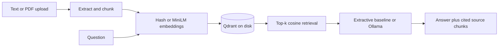

# RAG Document Intelligence

A document-search and question-answering service with persistent vector retrieval, source citations, an offline baseline, and an optional local LLM. Upload a PDF, TXT, or Markdown file, ask a question, and inspect the exact chunks used in the response.

**Stack:** Python 3.11+, FastAPI, Qdrant, scikit-learn, optional Sentence Transformers / MiniLM, optional Ollama, Docker, pytest.

## What is implemented

- Text and file ingestion; text extraction for digital PDFs, 150-word chunks with 30-word overlap.
- Persistent local Qdrant collection; content-derived document IDs make identical uploads idempotent; document deletion.
- Two embedding backends: deterministic 512-dimensional hashed lexical features (default) and 384-dimensional `all-MiniLM-L6-v2` semantic embeddings (optional).
- Top-k cosine retrieval, a configurable code-level relevance threshold, numbered citations, and an evidence-free abstention response.
- Extractive sentence answers without model downloads, or Ollama chat generation with the retrieved evidence in context.
- Browser client at `/`, OpenAPI documentation at `/docs`, optional API-key protection, bounded uploads and query inputs.
- Reproducible retrieval evaluation and tests covering persistence, deduplication, deletion, validation, and the Ollama request contract.



## Run locally

```bash
git clone https://github.com/abiy8/rag-document-intelligence.git
cd rag-document-intelligence
python -m venv .venv
# macOS/Linux:
source .venv/bin/activate
# Windows PowerShell: .venv\Scripts\Activate.ps1
pip install -r requirements.txt
uvicorn app.main:app --reload
```

Open http://localhost:8000. The default lexical/extractive mode works offline after installing dependencies. Configuration is read from environment variables; `.env` is for Docker Compose and is **not automatically loaded** by the Python command.

```bash
python -m pytest -q
python evaluate.py --backend hash
```

For semantic embeddings, install `requirements-semantic.txt`, set `EMBEDDING_BACKEND=semantic`, and start the server again. The first run downloads approximately 90 MB of MiniLM weights; allow additional PyTorch dependency space. Run `python evaluate.py --backend semantic` to evaluate that backend separately.

For local LLM answers, install [Ollama](https://ollama.com/), run `ollama pull llama3.2:3b`, and set `GENERATION_BACKEND=ollama`. `OLLAMA_URL` defaults to `http://localhost:11434`. In Docker, use `http://host.docker.internal:11434` with an Ollama host configured to accept that connection. No LLM weights or credentials are committed.

## Docker

```bash
cp .env.example .env
# Set a random API_KEY in .env before sharing the service.
docker compose up --build
```

The default image contains the lightweight lexical backend. To use semantic embeddings in Docker, change its pip install step to `requirements-semantic.txt`. The service binds to localhost, and Qdrant data is stored in a named volume. Local Qdrant permits one process per storage directory; run a single API worker. Distributed deployments should use a Qdrant server and tenant-level authorization, which are not implemented here.

## API example

```bash
curl -X POST http://localhost:8000/documents -H 'Content-Type: application/json' -d '{"name":"policy.txt","text":"Support tickets are retained for 90 days."}'
curl -X POST http://localhost:8000/query -H 'Content-Type: application/json' -d '{"question":"How long are support tickets retained?","k":3}'
```

Add `-H 'X-API-Key: YOUR_KEY'` when authentication is enabled. Never upload private documents to an untrusted deployment.

## Evaluation and limits

Results are recorded in [`reports/`](reports/). The benchmark has six authored synthetic policy documents, twelve answerable questions, and one unanswerable question. Recall@3 and MRR@3 measure document retrieval. Expected-answer substring matching is a limited extractive check, not a groundedness or hallucination benchmark. Timings depend on hardware and exclude ingestion/model download.

This is a portfolio implementation with production-oriented components, **not a verified production deployment**. LLM integration is contract-tested with a mocked response; running an actual Ollama model requires separate hardware and setup. Citations and a prompt do not guarantee factuality or prompt-injection resistance. OCR, streaming generation, multi-user isolation, rate limiting, and large-scale load testing are not implemented.

## Repository map

`app/engine.py` retrieval/generation · `app/main.py` API · `app/web.html` demo client · `examples/` authored evaluation corpus · `evaluate.py` benchmark · `tests/` behavioral tests.

## License

Original service code is MIT licensed. Optional pretrained models have their own model-card licenses. Synthetic policy documents are authored demonstration data, not real organization policies.

### Recorded development benchmark (2 October 2026)

| Backend | Recall@3 | MRR@3 | Expected-answer substring rate | Unanswerable abstention |
| --- | --- | --- | --- | --- |
| Hashed lexical baseline | 91.7% | 0.917 | 91.7% | 1/1 |
| MiniLM semantic embeddings | 100% | 1.000 | 100% | 1/1 |

Denominator: twelve answerable questions. The unanswerable set contains only one question, so no broad abstention-quality claim follows from its result. Both evaluations use extractive generation; they do not measure an Ollama model's answer quality.
